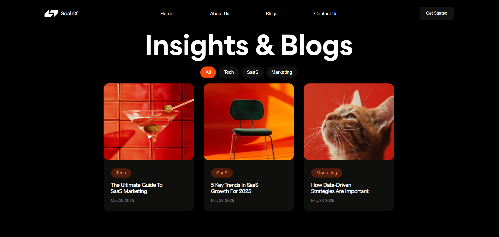

# ScaleX | Sheryians Cohort 3.0

 📝 **ScaleX ➖Growth & Tech Insights **| Where the world’s most innovative thinkers share the future of SaaS, Tech, and Marketing 📝

Welcome to my design assignment for the  **Sheryians Coding School Cohort 3.0** .

# 📸 Sneak Peek

[Live Link | Get Latest Insights](https://yashrajsinghmeel.github.io/Cohort3-A2/) 

# 🖋️ A Note for the Reviewer

This project was built to master the fundamentals of  **modern CSS layout and UI/UX design** . I’ve focused on creating a clean, high-performance UI that balances bold typography with a dark, sophisticated "vibe. I hope you enjoy the "scale" and precision I've brought to this assignment.

# ⚙️ Evolution of the Build (Tech Stack)

To bring this project to life, I used:

* **HTML5:** The skeletal structure of our Poké-world.
* **CSS3:** The yellow fur and rosy cheeks (styling, flexbox, and grid).
* **GitHub Pages:** To make the project live for you all  to see.

# 📖Assignment Context

* **School:** Sheryians Coding School
* **Program:** Cohort 3.0 ( Assignment-2 )
* **Objective:** UI/UX Recreation & CSS Mastery

# Made with ⚡ and 💛 by [ Yashraj Singh Meel ]

---
